# Architecture, assumptions and recovery

```mermaid
flowchart LR
  HF[FreshRetailNet Parquet] --> CLI[Python import and time-split pipeline]
  CLI --> Local[Local curated data and manifest]
  Local --> Training[Forecast and proxy ranking candidates]
  Training --> Reports[Metrics, checksum, prepared snapshot]
  Fixture[Independent grocery fixture] --> Snapshot[CSV snapshot]
  Reports --> Snapshot
  Snapshot --> Next[Next.js server-owned run]
  Next --> Allocate[Deterministic pack allocation]
  Allocate --> Human[Planner inspection and overrides]
  Human --> Validate[Server constraint validation]
  Validate --> Ship[Approved CSV and next-day package]
  Reports --> Gates[Fixed numeric gates]
  Gates --> Admin[Authenticated human review]
  Admin --> Registry[Approval then activation or rollback]
```

## Allocation objective

For each incremental pack, calculate recoverable shortage after scheduled delivery and the part the pack can fulfil. Expected margin = fulfilled synthetic operational quantities × (synthetic selling price − cost). Normalize margin by total recoverable margin across the input, and service gain by total recoverable shortage. Combine with equal weights from `config/objective.json`. Safe hard caps always precede allocation.

This is a deterministic greedy marginal-pack heuristic, not a mixed-integer global solver. It prioritizes marginal packs towards the configured 90% per-row fulfilment target before residual objective score. It may leave stock where receiving/category/case-size constraints bind and does not certify whether a better feasible solution exists. Remaining portfolio target shortfall and underserved rows are explicit. Tie-breaking uses store ID, SKU ID, then pack ordinal; the model challenger does not bypass constraints.

Stock reconciliation is per SKU. Store-SKU, store-category and receiving limits are checked cumulatively. Non-ranged, non-replenishable, blocker-data and out-of-horizon rows receive nothing. Negative/fractional final quantities and missing manual comments cannot be approved. Optional shipment limits and budget are supported by the engine; no budget is configured in the demo. Shelf-life/waste attributes are descriptive synthetic metadata, not a perishability optimization model.

Uniform daily demand is assumed within 14 days. The new shipment cannot recover demand already lost before delivery. Existing in-transit stock is assumed available for the horizon because the aggregate CSV inventory lacks per-row arrival attribution; this can overestimate early availability. Inventory value represents store inventory plus transit and proposed transfer, not a network working-capital reduction.

## Jobs, storage and safety boundary

One local Next.js process. Persistent jobs/run states, atomic JSON replacement, exclusive write lock, append-only audit events. Recommendation work runs asynchronously in-process; Python training/ingestion runs in a bounded subprocess with fixed CLI arguments. No user code is executed. Large rows stay in local files; pagination serves results.

Run creation binds idempotency key to snapshot reference. Overrides use revision numbers. Approval validates only server-owned data, uses a full-source integrity hash plus an inventory-only identity and consumes the stock snapshot once. It cannot approve client-supplied inventory/constraints. Approved CSV output and next-day packages are local files. Each next-day package is stored under its approval ID so later runs cannot overwrite an earlier branch; an active pointer selects the latest planning day. Failed approval side effects require manual recovery and never automatically release a consumed snapshot. This is intentionally conservative but not a database transaction.

If the server dies with a running job, inspect the last audit event and outputs. Restart queued runs by polling; running jobs and stale locks need operator review. Do not delete a consumed-snapshot record merely to retry. Multi-process deployment, durable external queues, user accounts/SSO and tamper-resistant audit storage are outside this POC.

## Known model limits

Only 90 historical days, normalized and censored sales, no real product names/costs/inventory/allocations. Synthetic inventory affects proxy ranking labels heavily. The measured challenger loses to the baselines, so the deterministic baseline stays active. Prepared forecasts are tied to their model snapshot, not a general realtime predictor. Next-day simulated packages fall back until rescored. Live outcome monitoring requires outcomes not available in the source; the default health state is insufficient evidence.

No LLM decides deployment, quantities, constraints, or approval. Optional conversational wording uses supplied calculations and cannot modify the model registry. Synthetic fixtures run without model API or Hugging Face keys.
